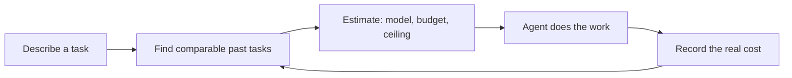

# Token Abacus

**Know what an AI agent task will cost before it runs, then give the agent a budget to work against.**

Token Abacus is an open source cost estimator for AI coding agents. Describe a task and it tells you
which model to use, how many dollars and tokens to budget, and where the ceiling is. Estimates come
from what similar tasks actually cost: about 17,000 recorded agent runs across 21 models, priced
from model list prices that refresh every hour.

- **Website:** [tokenabacus.com](https://tokenabacus.com)
- **MCP server for your agents:** [`token-abacus` on npm](https://www.npmjs.com/package/token-abacus)
- **License:** MIT

## Why it matters

AI agents start every task without knowing what it will cost. "Add Stripe billing" could be a $2
job or a $40 job, and an agent running unattended has no way to tell whether it is on track or
burning money. Most teams find out what they spent when the invoice arrives.

| Who | The problem | What Token Abacus gives them |
|---|---|---|
| Solo builders | "Can I afford to have an agent build this?" | A dollar estimate before pressing go |
| Teams running coding agents | Agents overspend, or stop early, with no guardrail | A budget and a ceiling for every task, based on real runs |
| Engineering leaders and finance | No way to forecast AI spend for a roadmap | Per-task estimates that add up to a quarterly budget |

The data also shows where money is wasted. In the SWE-bench seed data, on the same kind of bug fix,
MiniMax M2.5 succeeded 74% of the time at $0.11 per working fix, while Claude Opus 4.6 succeeded 72%
of the time at $0.83. Similar results at about one seventh of the cost, and an agent only knows
that if it asks first.

## How it works



1. **Estimate.** The task is matched with comparable past tasks by meaning, size, and type of work.
   Token Abacus recommends the cheapest model that succeeds on at least 70% of those tasks, sets the
   budget at the 85th-percentile cost plus 15% headroom, and sets the ceiling at the 95th percentile.
2. **Work.** The agent starts with a known budget and ceiling.
3. **Record.** When the task ends, the real token counts are read from the agent's own session log
   (the agent never reports its own usage), priced, and stored. Every finished task improves the
   next estimate.

Every estimate has a confidence level (high, medium, low) based on how many comparable tasks it
rests on. If nothing comparable exists, it says so instead of guessing.

## 1. Price a task on the website

1. Go to [tokenabacus.com](https://tokenabacus.com).
2. Describe what you want built, in plain English or by pasting the prompt you would give your
   agent. It may ask a few questions to narrow the scope.
3. Read the estimate: recommended model, dollar budget, token budget, ceiling, and the real tasks
   it is based on.

Example from the live database (October 2026):

> **Task:** Add Stripe subscription billing to a Next.js app
>
> **Estimate:** about **$1.89** on Claude Opus 5, 174k-token budget, low confidence. Based on a
> recorded Stripe webhook build for a Next.js app that cost $1.72.

Below the search box, the homepage lists recently recorded tasks and what they really cost.

The same estimate is available as an API, with no key required:

```bash
curl -s https://fgkiecqobecqwwqixrem.supabase.co/functions/v1/estimate \
  -H 'content-type: application/json' \
  -H 'x-abacus-install: my-team' \
  -d '{"prompt": "Add Stripe subscription billing to a Next.js app"}'
```

The response includes `recommendation` (model, `budget_usd`, `budget_tokens`, `ceiling_usd`,
`ceiling_tokens`), `confidence`, per-model stats, and `similar_tasks`. Full contract:
[docs/PLAN.md](docs/PLAN.md#5-api).

## 2. Give your agents a budget (MCP server)

```bash
npx token-abacus init
```

This adds the Token Abacus MCP server to Claude Code, Codex, and Cursor (whichever you have) and
asks whether to contribute anonymized task data. Restart your coding tool and give it a task.
Before it touches any code, the agent calls `estimate_task` and tells you the cost:

```
Estimate: ~$0.40 on claude-sonnet-5-5, budget 180k tokens (ceiling 290k), high confidence.
Based on 31 similar tasks. Cheaper option: claude-haiku-4-5 at ~$0.21.
```

The budget and ceiling stay in the agent's context while it works. When the task is done, the
agent calls `submit_run` and the local server reads the exact token usage from the session log.

| Coding tool | Estimates before a task | Exact cost recorded after |
|---|---|---|
| Claude Code | Yes | Yes, from the session log |
| Codex | Yes | Not yet (log reader in progress) |
| Cursor | Yes | Not yet (no readable log; tasks are stored as pending) |

| Command | What it does |
|---|---|
| `npx token-abacus init` | Add the MCP server to your coding tools. `--dry-run` previews, `--yes` skips prompts |
| `npx token-abacus import` | Turn your past Claude Code sessions into tasks with exact costs. Previews first; `--upload` contributes them |
| `npx token-abacus status` | Show your settings |

To remove it from Claude Code: `claude mcp remove token-abacus -s user && rm -rf ~/.token-abacus`.

Details: [cli/README.md](cli/README.md) and [docs/MCP.md](docs/MCP.md).

## 3. Budget your quarter from your kanban board

Estimate every card on the board, then add them up. Native integrations with GitHub Projects,
Linear, and Jira are on the roadmap. Today you can do it with the API. For example, for every open
GitHub issue labeled `Q4`:

```bash
gh issue list --repo your-org/your-repo --label Q4 --state open --limit 200 --json title --jq '.[].title' |
while read -r title; do
  curl -s https://fgkiecqobecqwwqixrem.supabase.co/functions/v1/estimate \
    -H 'content-type: application/json' -H 'x-abacus-install: quarter-plan' \
    -d "$(jq -n --arg p "$title" '{prompt: $p}')" |
  jq -r --arg t "$title" '[$t, (.recommendation.model // "no estimate"), (.recommendation.budget_usd // 0)] | @tsv'
done | tee q4-estimates.tsv |
awk -F'\t' '{ total += $3 } END { printf "Q4 agent budget: $%.2f\n", total }'
```

`q4-estimates.tsv` gets one row per card with the recommended model and its budget. Tips:

- Write cards as specific tasks ("Add passkey login to the Next.js app"), not themes ("Auth").
  Estimates match on the work described.
- A card with no estimate is either too vague or new territory. Split it, or budget it by hand.
- Each call takes a few seconds. The card title is sent to the API, so keep confidential details
  out of titles.

## What the estimates are built on

- **About 17,000 SWE-bench agent runs** across 21 models, each with a token breakdown, cost, and
  outcome.
- **Real coding-agent tasks** recorded by the MCP server and by `token-abacus import`.
- **Prices for 370+ models**, synced hourly from OpenRouter's public catalog. Price history is kept,
  so any past cost can be traced to the prices in force at the time.

Only tasks with real token counts feed estimates.

## Privacy

Contributing is opt-in, and estimates work without it.

- **Uploaded (if you opt in):** a one-sentence task description, a one-sentence summary, the models
  used, token counts, and timestamps.
- **Never uploaded:** code, file names, paths, prompts, or anything that identifies you.
- Text is scrubbed on your machine for API keys, emails, and paths before upload.
- Turn it off any time in `~/.token-abacus/config.json`.

## Repository layout

| Path | What it is |
| --- | --- |
| `cli/` | npm package `token-abacus`: the local MCP server and the `init`, `import`, `status` commands |
| `web/` | The website (Next.js), deployed to Vercel on every push to `main` |
| `supabase/` | Postgres + pgvector schema and Edge Functions (`estimate`, `submit`, `sync-pricing`, `tag-tasks`, `embed-backfill`) |
| `docs/` | [PLAN.md](docs/PLAN.md) (product and API), [MCP.md](docs/MCP.md), [SCHEMA.md](docs/SCHEMA.md), [FRONTEND.md](docs/FRONTEND.md) |

## Run it locally

Website:

```bash
cd web
cp .env.example .env.local   # fill in the keys you need
npm install
npm run dev                  # http://localhost:3000
```

MCP server against a mock API (no backend needed):

```bash
cd cli
npm install
npm run build
npm test
claude mcp add token-abacus-dev -e TOKEN_ABACUS_API=mock -- node "$PWD/dist/cli.js" mcp
```

Database and Edge Functions: see [docs/SCHEMA.md](docs/SCHEMA.md).

## Contributing

Issues and pull requests are welcome. The most direct way to improve estimates for everyone is to
contribute task data: opt in during `npx token-abacus init`, or run
`npx token-abacus import --upload` to add your past Claude Code sessions.

## License

MIT
